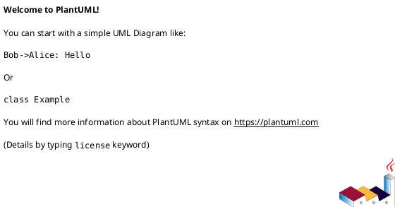

# 羊咩快报 - 需求与架构文档

## 架构与数据流图解

### 1. 数据库设计总览

#### 1.1 数据库实体关系图（ERD）

**解读：**  
本ERD图详细展示了羊咩快报平台的所有核心数据表及其字段、主外键关系和索引设计。主要包括：
- 用户系统（users、user_preferences等）
- 资讯内容系统（raw_news、news_categories、news_sources等）
- AI生成内容系统（ai_commentary、ai_audio_content、ai_video_content等）
- 社区互动系统（comments、likes、shares、topics等）
- 行为与推荐系统（play_history、favorites、recommendations、user_profiles等）
- 通知与系统配置（notifications、system_configs等）

**开发参考：**
- 后端建模、Django ORM设计、数据库迁移均以此为蓝本。
- 任何表结构变更需同步更新此ERD，确保数据一致性。
- 便于前后端、AI、数据分析等多团队协作时查阅。

---

### 2. 数据库分层架构

#### 2.1 分层架构图

**解读：**  
本图以分层方式展示了数据库的业务模块划分，主要分为：
- 用户管理层
- 内容管理层
- AI服务层
- 社区互动层
- 行为分析层
- 推荐系统层
- 通知系统层
- 系统配置层
- 管理后台层

**开发参考：**
- 有助于理解各业务模块的边界和数据归属。
- 支持后端多app拆分、微服务化、团队分工。
- 便于后续做权限、数据隔离、性能优化等架构决策。

---

### 3. 核心实体关系图

#### 3.1 核心业务主线

**解读：**  
本图聚焦于平台最核心的业务实体及其关系，包括：
- 用户（users）
- 原始新闻（raw_news）
- AI解说（ai_commentary）
- 音视频内容（ai_audio_content, ai_video_content）
- 播放历史（play_history）
- 推荐系统（recommendations）
- 用户画像（user_profiles）

**开发参考：**
- 适合新成员快速理解平台主线业务和数据流。
- 便于梳理核心API、数据同步、推荐算法等关键流程。
- 作为后续业务扩展、数据分析的基础。

---

### 4. AI内容生成数据流程图

#### 4.1 AI内容生成全链路

**解读：**  
本流程图详细描述了AI内容生成的端到端数据流，包括：
- 新闻源配置与定时爬取
- 原始新闻存储与质量检查
- AI内容生成任务（文本、音频、视频）
- AI模型选择与内容生成
- 内容标签标注与审核
- 内容发布与用户交互（播放、评论、点赞、分享）
- 行为统计、推荐、热点趋势分析、通知推送
- 系统配置与参数调优

**开发参考：**
- 明确AI内容生成的每个环节及其数据表/服务对应关系。
- 便于后端、AI、数据分析、前端等多团队协作开发。
- 支持后续流程优化、自动化、监控等工作。

---

## 总结与建议

- 以上四个图表是“羊咩快报”项目架构设计和数据流梳理的核心产物，建议每次大变更后都同步维护。
- 可将PlantUML源码与渲染图片一同存档，便于查阅和二次开发。
- 推荐在团队Wiki、需求文档、开发手册等处插入本节内容，作为新成员入门和开发协作的基础资料。

---

如需对某个图表进一步拆解（如详细讲解某个表、某个流程、某个业务模块），或需要导出为图片/Markdown/Word等格式，请随时告知！ 